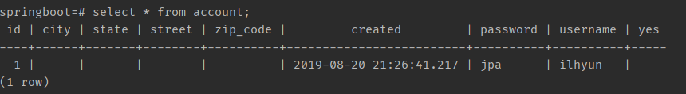
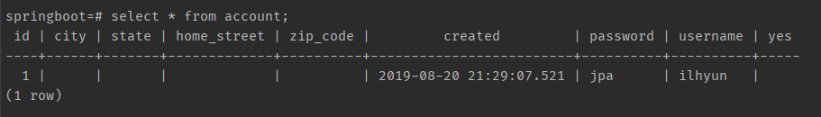
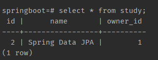
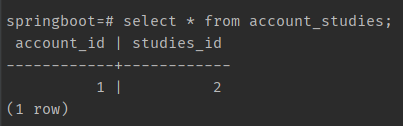

##목차

- [관계형 데이터베이스와 자바](#관계형-데이터베이스와-자바)
- [ORM: Object-Relation Mapping](#ORM:-Object-Relation-Mapping) 
- [JPA 프로그래밍: 프로젝트 세팅](#JPA-프로그래밍:-프로젝트-세팅)
- [JPA 프로그래밍: 엔티티 맵핑](#JPA-프로그래밍:-엔티티-맵핑)
- [JPA 프로그래밍: 1대다 맵핑](#JPA-프로그래밍:-1대다-맵핑)
- [JPA 프로그래밍: Cascade](#JPA-프로그래밍:-Cascade)
- [JPA 프로그래밍: Query](#JPA-프로그래밍:-Query)
- [스프링 데이터 JPA 소개 및 원리](#스프링-데이터-JPA-소개-및-원리)

## 왜 JPA를 학습해야 하는가?

- 도메인 주도 개발 가능
    - 애플리케이션 코드가 SQL 데이터베이스 관련 코드에 잠식 당하는 것을 방지하고 도메인 기반의 프로그래밍으로 비즈니스 로직을 구현하는데 집중할 수 있다.
- 개발 생산성이 좋으며, 데이터베이스에 독립적인 프로그래밍 가능
- 타입 세이프한 쿼리 작성 및 Persistent Context가 제고하는 캐시 기능으로 성능 최적화 가능

---

## ORM과 JPA에 대한 이론적인 배경의 이해

## 관계형 데이터베이스와 자바

**JDBC**

- (관계형) 데이터베이스와 자바의 연결고리
- DataSource / DriverManager
- Connection
- PreparedStatement

**SQL**

- DDL
- DML

#### 무엇이 문제인가?

- SQL을 실행하는 비용이 비싸다
- SQL이 데이터베이스마다 다르다
- 스키마를 바꿨더니 코드가 너무 많이 바뀐다
- 반복적인 코드가 너무 많다
- 당장은 필요가 없는데 언제 쓸 줄 모르니 미리 다 읽어야하는가..

---

## ORM: Object-Relation Mapping

JDBC 사용
~~~java
    try(Connection connection = DriverManager.getConnection(url, username, password)) {
    	System.out.println("Connection created: " + connection);
    	String sql = "INSERT INTO ACCOUNT VALUES(1, 'ilhyun', 'pass');";
    	try(PreparedStatement statement = connection.prepareStatement(sql)) {
    	    statement.execute();
    	}
    }
~~~

도메인 모델 사용
~~~java
    Account account = new Account(“ilhyun”, “pass”);
    accountRepository.save(account);
~~~

JDBC 대신 도메인 모델 사용하려는 이유?

- 객체 지향 프로그램이의 장점을 활용하기 좋으니까
- 각종 디자인 패턴
- 코드 재사용
- 비즈니스 로직 구현 및 테스트 편함

> ORM은 애플리케이션의 클래스와 SQL 데이터베이스의 테이블 사이의 **맵핑 정보를 기술한 메타데이터**를 사용하여, 자바 애플리케이션의 객체를 SQL 데이터베이스의 테이블에 **자동으로 (또 깨끗하게) 영속화** 해주는 기술

#### ORM의 장단점

- 장점
    - 생산성
    - 유지보수성
    - 성능
    - 벤더 독립성
 
- 단점
    - 학습비용
    
---
## JPA 프로그래밍: 프로젝트 세팅

> JPA 프로그래밍 연습을 위한 기본 프로젝트 세팅을 해보자

_Spring Boot, PostgreSQL 활용_

데이터베이스 실행
- PostgreSQL 도커 컨테이너 사용
    - [Docker PostgreSQL 사용](https://shinilhyun.github.io/devlog/2019/08/20/devlog-infra-docker-postgres-install/)

스프링 부트 의존성 추가
~~~html
    <!--PostgreSQL 드라이버 추가-->
    <dependency>
        <groupId>org.postgresql</groupId>
        <artifactId>postgresql</artifactId>
    </dependency>
    
    <!--JPA 의존성 추가-->
    <dependency>
        <groupId>org.springframework.boot</groupId>
        <artifactId>spring-boot-starter-data-jpa</artifactId>
    </dependency>
~~~

JDBC 설정 및 Hibernate 설정 (application.properties)

~~~
spring.datasource.url=jdbc:postgresql://localhost:5432/springboot
spring.datasource.username=shinilhyun
spring.datasource.password=1234

# 개발할때는 create 혹은 update 운영시에는 validate
spring.jpa.hibernate.ddl-auto=create

#실행시 warnning 제거하기 위해
spring.jpa.properties.hibernate.jdbc.lob.non_contextual_creation=true

#콘솔에 실행된 sql 띄워줌
spring.jpa.show-sql=true
#sql 읽기 쉽게 해줌
spring.jpa.properties.hibernate.format_sql=true
~~~

JpaRunner 를 통한 JPA 사용
~~~java
@Component
@Transactional
public class JpaRunner implements ApplicationRunner {

    @PersistenceContext
    EntityManager entityManager;

    @Override
    public void run(ApplicationArguments args) throws Exception {

        Account account = new Account();
        account.setUsername("ilhyun");
        account.setPassword("jpa");
        entityManager.persist(account);
    }
}
~~~

## JPA 프로그래밍: 엔티티 맵핑

`@Entity`

- “엔티티”는 객체 세상에서 부르는 이름.
- 보통 클래스와 같은 이름을 사용하기 때문에 값을 변경하지 않음.
- 엔티티의 이름은 JQL에서 쓰임.

`@Table`

- “릴레이션" 세상에서 부르는 이름.
- @Entity의 이름이 기본값.
- 테이블의 이름은 SQL에서 쓰임.

`@Id`

- 엔티티의 주키를 맵핑할 때 사용.
- 자바의 모든 `primitive` 타입과 그 `랩퍼 타입`을 사용할 수 있음
    - Date랑 BigDecimal, BigInteger도 사용 가능.
- 복합키를 만드는 맵핑하는 방법도 있지만 그건 논외로..

`@GeneratedValue`

- 주키의 생성 방법을 맵핑하는 애노테이션
- 생성 전략과 생성기를 설정할 수 있다.
    - 기본 전략은 AUTO: 사용하는 DB에 따라 적절한 전략 선택
    - TABLE, SEQUENCE, IDENTITY 중 하나.

`@Column`

- unique
- nullable
- length
- columnDefinition
- ...

`@Temporal`

- 현재 JPA 2.1까지는 Date와 Calendar만 지원.

`@Transient`

- 컬럼으로 맵핑하고 싶지 않은 멤버 변수에 사용.

Account Entity

~~~java
@Entity
public class Account {

    @Id @GeneratedValue
    private Long id;

    @Column(nullable = false, unique = true)
    private String username;

    private String password;

    @Temporal(TemporalType.TIMESTAMP)
    private Date created = new Date();

    private String yes;

    @Transient
    private String no;

  //getter setter 생략 가능
}
~~~

`엔티티 타입`과 `Value 타입` 구분

- 식별자가 있어야 하는가.
  - `앤티티 타입`은 고유한 식별자가 있다. `@Id`
- 독립적으로 존재해야 하는가.

**Value 타입 종류**

- 기본 타입 (String, Date, Boolean, ...)
- `Composite Value 타입`
- `Collection Value 타입`
  - 기본 타입의 콜렉션
  - 컴포짓 타입의 콜렉션

**Composite Value 타입 맵핑**

- @Embeddable
- @Embedded
- @AttributeOverrides
- @AttributeOverride

Composite Value 타입 Address

```java
@Embeddable
public class Address {

    private String street;

    private String city;

    private String state;

    private String zipCode;
}
```

Account 에 추가

```java
@Entity
public class Account {

    @Id @GeneratedValue
    private Long id;

    @Column(nullable = false, unique = true)
    private String username;

    private String password;

    @Temporal(TemporalType.TIMESTAMP)
    private Date created = new Date();

    private String yes;

    @Transient
    private String no;
		
		//생성한 composite 타입 추가
    @Embedded
    private Address address;
}
```

결과



`@AttributeOverrides`  를 이용한 컬럼명 변경하여 추가

```java
// street를 home_street로 변경
@Embedded
    @AttributeOverrides({
        @AttributeOverride(name = "street", column = @Column(name = "home_street"))
    })
    private Address address;
```



---

## JPA 프로그래밍: 1대다 맵핑

**관계에는 항상 두 엔티티가 존재**

- 둘 중 하나는 그 관계의 주인(owning)이고
- 다른 쪽은 종속된(non-owning) 쪽
- 해당 관계의 반대쪽 레퍼런스를 가지고 있는 쪽이 주인.

**단방향에서의 관계의 주인은 명확**

- `관계를 정의한 쪽이 그 관계의 주인`


__단방향 `@ManyToOne`__

- 기본값은 FK 생성
    
    _ex) Study에 Account `@ManyToOne`으로 추가_
  ```java
        @Entity
        public class Study {
        
            @Id @GeneratedValue
            private Long id;
        
            private String name;
        
            @ManyToOne
            private Account owner;
        ...
        }
  ```
  ```java

        @Component
        @Transactional
        public class JpaRunner implements ApplicationRunner {
        
            @PersistenceContext
            EntityManager entityManager;
        
            @Override
            public void run(ApplicationArguments args) throws Exception {
        
                Account account = new Account();
                account.setUsername("ilhyun");
                account.setPassword("jpa");
        
                Study study = new Study();
                study.setName("Spring Data JPA");
                study.setOwner(account);
        
                account.getStudies().add(study);
        
                entityManager.persist(account);
                entityManager.persist(study);
            }
        }
    ```
  
_이 경우 study 가 주인, Study에서 owner을 정의했기 때문!_



name + _id 형태의 FK로 생성된다.

__단방향 `@OneToMany`__

- 기본값은 조인 테이블 생성

Account에 Studies 추가

```java
@Entity
public class Account {

    @Id @GeneratedValue
    private Long id;

    @Column(nullable = false, unique = true)
    private String username;

    private String password;

    @OneToMany
    private Set<Study> studies = new HashSet<>();
...
}
```



_account_studies 와 같은 조인 테이블이 생성되며 이 경우 관계의 주인은 Account이다._


__양방향__

- FK 가지고 있는 쪽이 오너 따라서 기본값은 `@ManyToOne` 가지고 있는 쪽이 주인.
- 주인이 아닌쪽(@OneToMany쪽)에서 `mappedBy` 사용해서 관계를 맺고 있는 필드를 설정해야 한다.

양방향

- `@ManyToOne` (이쪽이 주인)
- `@OneToMany`(mappedBy)
- 주인한테 관계를 설정해야 DB에 반영이 된다.
```java
    @Entity
    public class Account {
    
        ...
        @OneToMany(mappedBy = "owner")
        private Set<Study> studies = new HashSet<>();
    		...
    }

    @Entity
    public class Study {
    
        @Id @GeneratedValue
        private Long id;
    
        private String name;
    
        @ManyToOne
        private Account owner;
    ...
    }
```
```java


    @Component
    @Transactional
    public class JpaRunner implements ApplicationRunner {
    
        @PersistenceContext
        EntityManager entityManager;
    
        @Override
        public void run(ApplicationArguments args) throws Exception {
    
            Account account = new Account();
            account.setUsername("ilhyun");
            account.setPassword("jpa");
    
            Study study = new Study();
            study.setName("Spring Data JPA");
            study.setOwner(account);
    
    				account.addStudy(study);    // 아래 두 코드를 매서드를 만들어서 처리
    //        account.getStudies().add(study);    // 옵셔널이지만 객체지향적으로 생각했을 때
      //      study.setOwner(account);// 양방향이기 때문에 추가(빠지면 관계 생성 안된다)
    
            entityManager.persist(account);
            entityManager.persist(study);
        }
    }
```
```java
    //	Account.java에 추가
    
    	public void addStudy(Study study) {
            this.getStudies().add(study);
            study.setOwner(this);
        }
    
        public void removeStudy(Study study) {
            this.getStudies().remove(study);
            study.setOwner(null);
        }
```


_관계의 주인은 Study 이므로 Account 에서 `mappedBy`를 통해 `양방향 관계`를 맺어준다._

---

**엔티티의 상태** 변화를 전파 시키는 옵션.

잠깐? **엔티티의 상태**가 뭐지?

- Transient: JPA가 모르는 상태
- Persistent: JPA가 관리중인 상태 (1차 캐시, Dirty Checking, Write Behind, ...)
- Detached: JPA가 더이상 관리하지 않는 상태.
- Removed: JPA가 관리하긴 하지만 삭제하기로 한 상태.


Cascade 예시

```java
@Entity
public class Post {

    @Id @GeneratedValue
    private Long id;

    private String title;

    @OneToMany(mappedBy = "post")
    private Set<Comment> comment = new HashSet<>();

    public void addComment(Comment comment) {
        this.getComment().add(comment);
        comment.setPost(this);
    }
...
}
```

```java
@Entity
public class Comment {

    @Id @GeneratedValue
    private Long id;

    private String comment;

    @ManyToOne
    private Post post;
...
}
```

```java

@Component
@Transactional
public class JpaRunner implements ApplicationRunner {

    @PersistenceContext
    EntityManager entityManager;

    @Override
    public void run(ApplicationArguments args) throws Exception {

        Post post = new Post();
        post.setTitle("Spring Data Jpa 언제 보나...");

        Comment comment = new Comment();
        comment.setComment("빨리 보고 싶어요.");
        post.addComment(comment);

        Comment comment1 = new Comment();
        comment1.setComment("곧 보여드릴게요.");
        post.addComment(comment1);

        Session session = entityManager.unwrap(Session.class);
        session.save(post);
    }
}
```
위와 같은 경우 post만 저장하였기 때문에 **Comment 테이블은 비어있어야 한다.**

하지만 아래와 같이 CascadeType 옵션을 설정하면 post만 저장해도 연관된 comment까지 같이 저장된다. *`CascadeType.PERSIST` 와 `CascadeType.REMOVE`를 합쳐서 `CascadeType.ALL` 로 많이 쓴다.*
```java
@OneToMany(mappedBy = "post", cascade = {CascadeType.PERSIST, CascadeType.REMOVE})
private Set<Comment> comment = new HashSet<>();
```
---

## JPA 프로그래밍: Query

`JPQL` (HQL)

- Java Persistence Query Language / Hibernate Query Language
- 데이터베이스 테이블이 아닌, 엔티티 객체 모델 기반으로 쿼리 작성.
- JPA 또는 하이버네이트가 해당 쿼리를 SQL로 변환해서 실행함.
- [https://docs.jboss.org/hibernate/orm/5.2/userguide/html_single/Hibernate_User_Guide.html#hq](https://docs.jboss.org/hibernate/orm/5.2/userguide/html_single/Hibernate_User_Guide.html#hql)

```java
TypedQuery<Post> query = entityManager.createQuery("SELECT p FROM Post As p", Post.class);
List<Post> posts = query.getResultList();
```

`Criteria`

- 타입 세이프 쿼리
- [https://docs.jboss.org/hibernate/orm/5.2/userguide/html_single/Hibernate_User_Guide.html#criteria](https://docs.jboss.org/hibernate/orm/5.2/userguide/html_single/Hibernate_User_Guide.html#criteria)

```java
CriteriaBuilder builder = entityManager.getCriteriaBuilder();
CriteriaQuery<Post> criteria = builder.createQuery(Post.class);
Root<Post> root = criteria.from(Post.class);
criteria.select(root);
List<Post> posts = entityManager.createQuery(criteria).getResultList();
```
Native Query

- SQL 쿼리 실행하기
- [https://docs.jboss.org/hibernate/orm/5.2/userguide/html_single/Hibernate_User_Guide.html#sq](https://docs.jboss.org/hibernate/orm/5.2/userguide/html_single/Hibernate_User_Guide.html#sql)

```java
List<Post> posts = entityManager
                        .createNativeQuery("SELECT * FROM Post", Post.class)
                        .getResultList();
```

---

## 스프링 데이터 JPA 소개 및 원리

Post 의 Repository 예

```java
@Repository
@Transactional
public class PostRepository {

    @PersistenceContext
    EntityManager entityManager;

    public Post add(Post post) {
        entityManager.persist(post);
        return post;
    }

    public void delete(Post post) {
        entityManager.remove(post);
    }

    public List<Post> findAll() {
        return entityManager.createQuery("SELECT p FROM Post AS p", Post.class)
            .getResultList();
    }
}
```

`**JpaRepository<Entity, Id>` 인터페이스**

- 매직 인터페이스
- `@Repository`가 없어도 빈으로 등록해 줌. 위의 코드 작성하지 않아도 인터페이스로 기능대체

```java
public interface PostRepository extends JpaRepository<Post, Long> {
}
```

`**@EnableJpaRepositories**`

- 매직의 시작은 여기서 부터

매직은 어떻게 이뤄지나?

- 시작은 `@Import(**JpaRepositoriesRegistrar.class**)`
- 핵심은 **`ImportBeanDefinitionRegistrar`** 인터페이스

그동안 entityManager를 사용해서 작성한 코드에 비해 깔끔하고 편리

```java
    @Component
    @Transactional
    public class JpaRunner implements ApplicationRunner {
    
        @Autowired
        PostRepository postRepository;
    
        @Override
        public void run(ApplicationArguments args) throws Exception {
            postRepository.findAll().forEach(System.out::println);
        }
    }
```

---